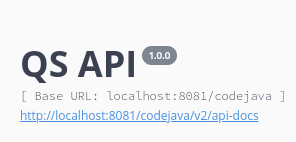
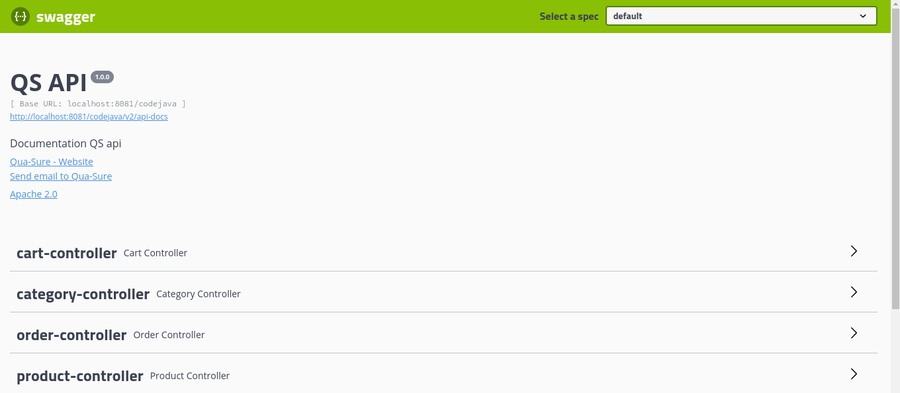
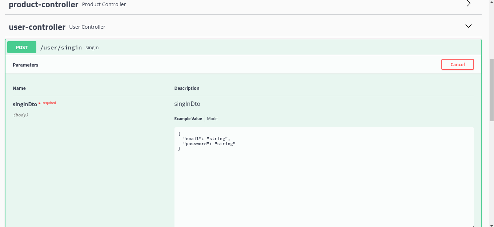
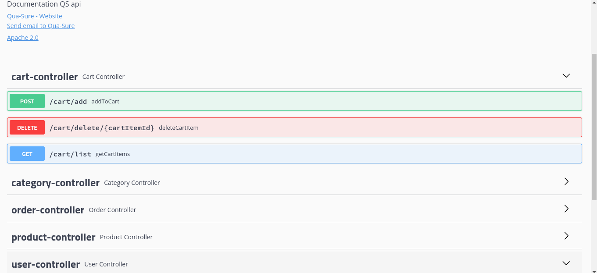

# Qua-Sure
## E-Commerce Application with NEAR Smart Contracts

## Table of Contents
- [Description](#description)
- [Features](#features)
- [Technologies](#technologies)
- [Getting Started](#getting-started)
- [Usage](#usage)
- [Smart Contracts](#smart-contracts)
- [Contributing](#contributing)
- [License](#license)
- [Contact](#contact)

## Description
This is an E-Commerce application built using Spring Boot that leverages smart contracts developed in Rust based on the NEAR protocol to facilitate secure and decentralized payments. The application allows users to browse products, add items to their cart, and seamlessly complete transactions using NEAR-based smart contracts. 
The endpoints have been managed using swagger.

## Features
- Browse and search for products
- Add products to the cart
- Secure and transparent payments through NEAR smart contracts
- User authentication and profile management
- Order history and tracking
- Wish List

## Technologies
- Spring Boot
- Spring data JDBC
- Spring Security
- Swagger
- NEAR Protocol
- Rust
- MySQL (or your preferred database)
- Docker (for containerization)

## Getting Started
1. Clone the repository: `git clone https://github.com/yourusername/ecommerce-near.git`
2. Install dependencies: `cd ecommerce-near && mvn install`
3. Configure application properties (database, NEAR wallet, etc.): `src/main/resources/application.properties`
4. Run the application: `mvn spring-boot:run`

## Usage
1. Browse the products and add items to your cart.
2. Proceed to checkout, where the NEAR-based smart contract will handle the payment.
3. Receive a confirmation of your order and track its status.

## Smart Contracts
The NEAR-based smart contracts for this application are developed in Rust. They handle payment processing and ensure secure and transparent transactions. The contracts are deployed on the NEAR blockchain and integrated into the application.

## Contributing
Contributions are welcome! If you'd like to contribute to this project, please follow the guidelines in [CONTRIBUTING.md](CONTRIBUTING.md).

## License
This project is licensed under the [MIT License](LICENSE).

## Contact
For questions or feedback, please contact:
- Kevin Mugiira
- Email: kevinmugiira@gmail.com
- LinkedIn: [Kevin Mugiira](https://www.linkedin.com/in/kevin-mugiira-b7a06b128/)

---

## Screenshots

### Swagger Home Page

### Registering a User endpoints

### Cart endpoints

